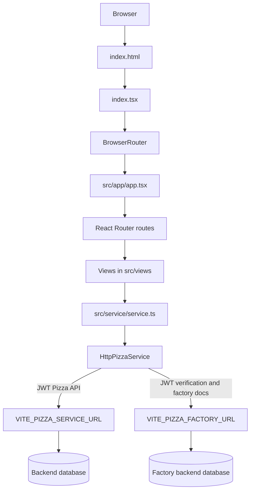

# JWT Pizza Architecture

This repository is the frontend for JWT Pizza. It is a Vite + React single-page application (SPA) written in TypeScript. The backend services are remote; their implementations and database SQL are not included in this repository.

## High-level request flow



The browser never calls the database directly. A view calls the `pizzaService` interface, the HTTP implementation builds a request, and a remote backend performs authorization, business logic, and database operations.

## Application layers

### 1. HTML entry point

[index.html](index.html) provides the `root` element and loads [index.tsx](index.tsx) as a Vite module.

[index.tsx](index.tsx) creates the React root and wraps `App` in `BrowserRouter`. This enables client-side navigation without full page reloads.

### 2. Application shell and routing

[src/app/app.tsx](src/app/app.tsx) is the application coordinator. It:

- Stores the current `User | null` in React state.
- Calls `pizzaService.getUser()` once when the app starts, using the token in `localStorage` to restore a session.
- Defines the route list in `navItems`.
- Renders the shared `Header`, `Breadcrumb`, page route, and `Footer`.
- Shows navigation items conditionally for logged-in users and admins.
- Reinitializes Preline widgets and scrolls to the top whenever the pathname changes.

The route list is data-driven: the same `navItems` array is used to create `<Route>` elements and to build navigation links.

### 3. Views and components

[src/views](src/views) contains page-level components. Views own page state and user interactions, such as form values, selected pizzas, and navigation. Shared visual pieces are in [src/components](src/components), including `View`, `Button`, `Card`, `Breadcrumb`, `Carousel`, and `Quote`.

[src/app/header.tsx](src/app/header.tsx) and `footer.tsx` provide the shared shell. [src/hooks/appNavigation.tsx](src/hooks/appNavigation.tsx) contains `useBreadcrumb`, which navigates to the parent URL while preserving React Router location state.

### 4. Service abstraction

[src/service/pizzaService.ts](src/service/pizzaService.ts) defines the frontend data types and the `PizzaService` interface. It also defines the roles:

- `diner`
- `franchisee`
- `admin`

[src/service/service.ts](src/service/service.ts) exports the active service as the interface type. The current implementation is `HttpPizzaService`, but views do not need to know that detail. This makes the service replaceable and gives the app one place to change if the backend contract changes.

### 5. HTTP adapter and authentication

[src/service/httpPizzaService.ts](src/service/httpPizzaService.ts) implements all remote calls through `callEndpoint`:

1. It creates a `fetch` request with JSON headers and `credentials: 'include'`.
2. It reads `localStorage.token`.
3. If a token exists, it sends `Authorization: Bearer <token>`.
4. Relative paths are prefixed with `VITE_PIZZA_SERVICE_URL`.
5. The response is parsed as JSON.
6. Successful responses resolve with the JSON body; failed responses reject with `{ code, message }`.

Login and registration store the returned token. Logout removes it. On startup, `getUser()` validates the existing token by calling `/api/user/me`; an invalid token is removed.

## Backend services and endpoint calls

The exact base URLs come from Vite environment variables:

- `VITE_PIZZA_SERVICE_URL`: normal JWT Pizza API.
- `VITE_PIZZA_FACTORY_URL`: pizza factory API, used for order verification and factory documentation.

The frontend calls these paths:

| Frontend service method | HTTP call | Purpose |
| --- | --- | --- |
| `login` | `PUT /api/auth` | Authenticate and receive a user plus JWT. |
| `register` | `POST /api/auth` | Create a user and receive a user plus JWT. |
| `logout` | `DELETE /api/auth` | Tell the service to log out, then remove the local token. |
| `getUser` | `GET /api/user/me` | Restore and validate the current session. |
| `getMenu` | `GET /api/order/menu` | Load available pizzas. |
| `getOrders` | `GET /api/order` | Load the current user's order history. |
| `order` | `POST /api/order` | Submit an order and receive the saved order plus a JWT. |
| `verifyOrder` | `POST <factory>/api/order/verify` | Verify the order JWT and return its decoded payload. |
| `getFranchise` | `GET /api/franchise/{user.id}` | Load franchises associated with a user. |
| `getFranchises` | `GET /api/franchise?page=...&limit=...&name=...` | List franchises for the menu or admin dashboard. |
| `createFranchise` | `POST /api/franchise` | Create a franchise and assign an admin email. |
| `closeFranchise` | `DELETE /api/franchise/{franchise.id}` | Close a franchise. |
| `createStore` | `POST /api/franchise/{franchise.id}/store` | Create a store under a franchise. |
| `closeStore` | `DELETE /api/franchise/{franchise.id}/store/{store.id}` | Close a store. |
| `docs('service')` | `GET /api/docs` | Load normal service endpoint documentation. |
| `docs('factory')` | `GET <factory>/api/docs` | Load factory endpoint documentation. |

The backend is responsible for the SQL queries, transactions, authorization checks, and persistence behind those endpoints. No SQL files or backend handlers are present here. The `/docs` endpoints can expose example requests and response shapes, but they do not expose the database implementation.

## User activity flows

This table connects the activities in `notes.md` to the frontend code and the remote calls it makes.

| User activity | Frontend component(s) | Backend endpoint(s) | Database SQL in this repo |
| --- | --- | --- | --- |
| View home page | `Home`, `View`, `Carousel`, `Quote` | None | None; static content and images. |
| Register new user | `Register` | `POST /api/auth` | Backend creates the user and role. SQL is not included. |
| Login new user | `Login` | `PUT /api/auth` | Backend validates credentials and creates/returns a token. |
| Order pizza | `Menu`, `Payment` | `GET /api/order/menu`, `GET /api/franchise?...`, then `POST /api/order` | Backend reads menu/stores and persists the order. |
| Verify pizza | `Delivery` | `POST <factory>/api/order/verify` | Factory backend verifies the signed token; no SQL is visible here. |
| View profile page | `DinerDashboard` | `GET /api/user/me`, `GET /api/order` | Backend reads user and order data. |
| View franchise as diner | `FranchiseDashboard` | `GET /api/franchise/{user.id}` | Backend reads franchises associated with the user. |
| Logout | `Logout` | `DELETE /api/auth` | Backend may invalidate a session; frontend also removes `localStorage.token`. |
| View About page | `About` | None | None; static content. |
| View History page | `History` | None | None; static content. |
| Login as franchisee | `Login` | `PUT /api/auth` | Backend authenticates the account and returns its roles. |
| View franchise as franchisee | `FranchiseDashboard` | `GET /api/franchise/{user.id}` | Backend reads the franchise and its stores. |
| Create a store | `CreateStore` | `POST /api/franchise/{franchise.id}/store` | Backend inserts the store. |
| Close a store | `CloseStore` | `DELETE /api/franchise/{franchise.id}/store/{store.id}` | Backend deletes or deactivates the store. |
| Login as admin | `Login` | `PUT /api/auth` | Backend authenticates the admin and returns the admin role. |
| View Admin page | `AdminDashboard` | `GET /api/franchise?page=0&limit=3&name=*` | Backend reads paginated franchise/store data. |
| Create a franchise for a user | `CreateFranchise` | `POST /api/franchise` | Backend inserts the franchise and associates the admin email. |
| Close the franchise for a user | `CloseFranchise` | `DELETE /api/franchise/{franchise.id}` | Backend closes the franchise and associated stores. |

## Detailed order flow

1. `Home` navigates to `/menu`.
2. `Menu` loads the menu and up to 20 franchises/stores in parallel-sequential effect code.
3. Selecting a pizza adds an `OrderItem` to local React state.
4. Checkout adds `storeId` and `franchiseId`, then passes the order through React Router `location.state` to `/payment`.
5. `Payment` checks `getUser()`. If there is no session, it navigates to `/payment/login` while preserving the order state.
6. `Payment` calls `POST /api/order`.
7. The response contains both `order` and a signed `jwt`; `Payment` passes them to `/delivery` through route state.
8. `Delivery` displays the order and token. Verify calls the factory service and displays the returned payload.

Order data passed between views is temporary browser memory. It is not persisted until `Payment` calls `order`.

## Role and navigation behavior

`App` uses `Role.isRole(user, role)` to decide whether a user has a role. The header hides the Admin link unless the user is an admin, and hides Login/Register when logged in. The admin page also checks the role and renders `NotFound` for non-admin users.

These checks improve the user experience, but they are not the security boundary. The backend must independently enforce authorization on every protected endpoint because a browser user can manually request any URL or API call.

## Important state locations

| State | Where it lives | Why it matters |
| --- | --- | --- |
| Current user | `App` React state | Shared by header and role-aware pages. |
| JWT | `localStorage` key `token` | Reused by `HttpPizzaService` for the Authorization header. |
| Order while shopping | `Menu` React state | Builds the order before checkout. |
| Order between checkout pages | React Router `location.state` | Passes the order from menu to payment and delivery. |
| Environment URLs | `import.meta.env` | Selects the remote pizza and factory services at build time. |

## Running and inspecting the application

```sh
npm install
npm run dev
```

Useful places to set breakpoints:

- [index.tsx](index.tsx): application startup.
- [src/app/app.tsx](src/app/app.tsx): user restoration and route selection.
- [src/service/httpPizzaService.ts](src/service/httpPizzaService.ts): every HTTP request and JWT header.
- [src/views/menu.tsx](src/views/menu.tsx): menu/store loading and order construction.
- [src/views/payment.tsx](src/views/payment.tsx): order submission.
- [src/views/delivery.tsx](src/views/delivery.tsx): JWT verification.
- [src/views/adminDashboard.tsx](src/views/adminDashboard.tsx): admin franchise management.

The `/docs/service` and `/docs/factory` routes are also useful for seeing the backend's documented endpoint contracts.

## Why these files use `.tsx` instead of `.jsx`

`.tsx` means **TypeScript plus JSX**:

- `.ts` is TypeScript without JSX markup.
- `.tsx` is TypeScript that contains JSX such as `<App />` and `<div>`.
- `.js` is JavaScript without JSX.
- `.jsx` is JavaScript with JSX.

This project uses `.tsx` because the React components contain JSX and TypeScript types. For example, [src/service/pizzaService.ts](src/service/pizzaService.ts) declares types such as `User`, `Order`, and `Franchise`, while [src/views/login.tsx](src/views/login.tsx) uses typed props and refs:

```tsx
interface Props {
  setUser: (user: User) => void;
}

const emailRef = React.useRef<HTMLInputElement>(null);
```

The setting in [tsconfig.json](tsconfig.json) confirms JSX support with `"jsx": "react"`, and `index.html` loads `/index.tsx`. Vite and the TypeScript toolchain transform the `.tsx` source into browser-compatible JavaScript during development and the production build. The browser does not execute `.tsx` directly.

Using `.jsx` would be valid for a JavaScript version of the app, but it would remove compile-time type checking unless the project separately enabled JavaScript checking. In this codebase, `.tsx` lets the editor and compiler catch mismatched props, invalid state shapes, and incorrect service data before runtime.
